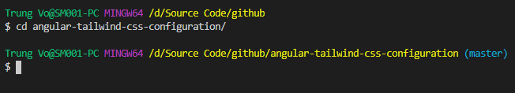
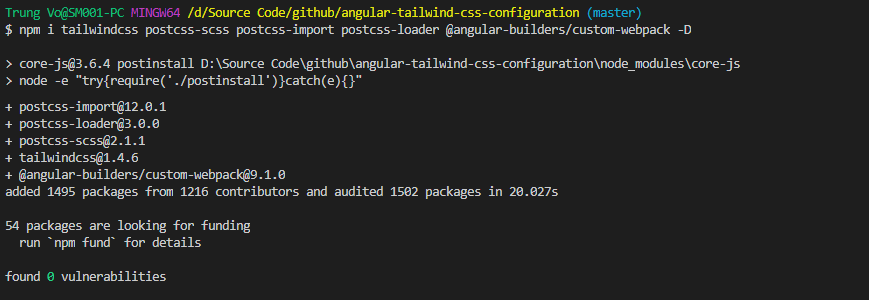
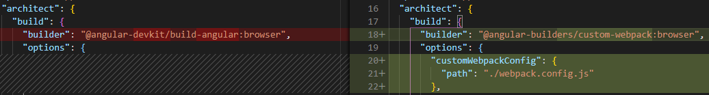
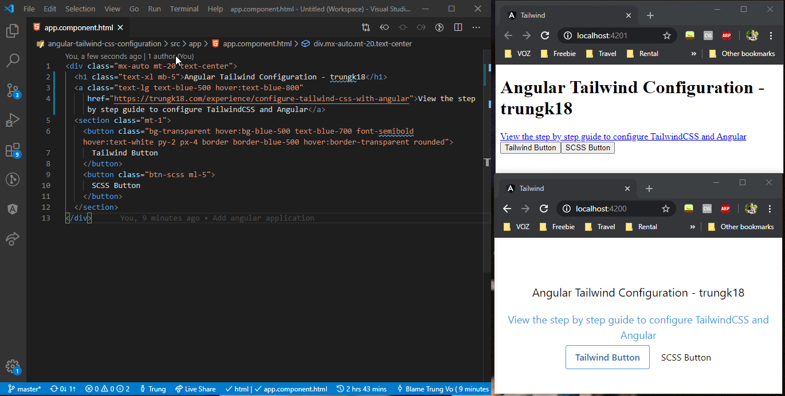
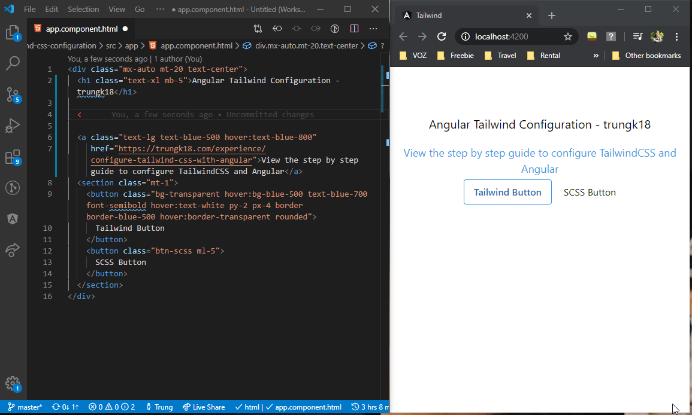
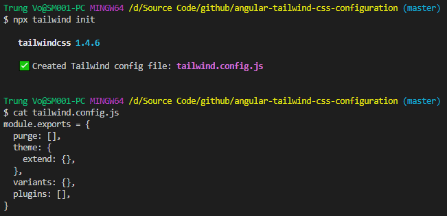
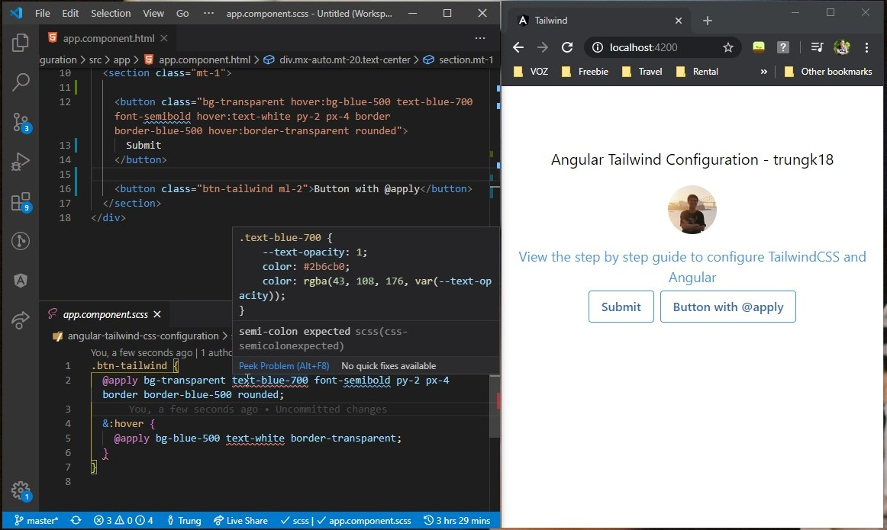

# angular-tailwind-css-configuration

A step by step tutorial for configuration TailwindCSS with Angular application.


I also post this tutorial on my personal blog page.

https://trungk18.com/experience/configure-tailwind-css-with-angular

TL;DR: This configuration is tested on Angular 9. It is also working on the previous version of Angular such as 8.x.x. It is also working with AOT when you do `ng build --aot=true`

## Table Of Contents

- [angular-tailwind-css-configuration](#angular-tailwind-css-configuration)
  - [Update Aug 2020](#update-aug-2020)
    - [Usage](#usage)
  - [Problem](#problem)
    - [1. Quick and dirty way: inline style](#1-quick-and-dirty-way-inline-style)
    - [2. Create a new class for each element, such as](#2-create-a-new-class-for-each-element-such-as)
    - [3. Create a common CSS on a top-level component](#3-create-a-common-css-on-a-top-level-component)
  - [How to configure TailwindCSS with Angular CLI](#how-to-configure-tailwindcss-with-angular-cli)
    - [1. Open the command line and go to the Angular application folder](#1-open-the-command-line-and-go-to-the-angular-application-folder)
    - [2. Install TailwindCSS package and dependencies needed](#2-install-tailwindcss-package-and-dependencies-needed)
    - [3. Import Tailwind CSS to your style.scss](#3-import-tailwind-css-to-your-stylescss)
    - [4. Create a webpack.config.js file at the root of your project](#4-create-a-webpackconfigjs-file-at-the-root-of-your-project)
      - [This is what it should look like for `postcss-loader@^3.0`](#this-is-what-it-should-look-like-for-postcss-loader30)
      - [If you are using `postcss-loader@^4.0`, take this config instead](#if-you-are-using-postcss-loader40-take-this-config-instead)
      - [Controlling file size with Tailwind](#controlling-file-size-with-tailwind)
      - [postcss-scss](#postcss-scss)
    - [5. Modify the angular.json file to use the custom builder and the webpack config file](#5-modify-the-angularjson-file-to-use-the-custom-builder-and-the-webpack-config-file)
    - [6. We are finished](#6-we-are-finished)
  - [Configure to use TailwindCSS effectively in VSCode](#configure-to-use-tailwindcss-effectively-in-vscode)
    - [1. Install Tailwind CSS IntelliSense](#1-install-tailwind-css-intellisense)
    - [2. Create a Tailwind configuration file](#2-create-a-tailwind-configuration-file)
  - [Using TailwindCSS @apply syntax](#using-tailwindcss-apply-syntax)
  - [Source code](#source-code)
  - [Notes](#notes)
  - [Reference](#reference)

## Update Aug 2020

My friend [@nartc](https://github.com/nartc) Just released an @angular schematics to add @tailwindcss to your @angular/cli projects.

- Setup Custom Webpack
- Setup PurgeCSS
- Update angular.json and styles
- Support Nx Workspace

### Usage

Simple run a single command on your Angular CLI project and you are all set!

```bash
ng add @ngneat/tailwind
```

See more ➡ https://github.com/ngneat/tailwind

## Problem

Everyone has a different way of organizing and working with CSS. I always encounter some use case where I need to set a simple `padding-left: 5px`, or `margin: 0 auto`, or to make an element to have `cursor: pointer`.

I have a few options for doing so.

### 1. Quick and dirty way: inline style

```html
<button style="padding-left: 5px;">Submit</button>
<i style="cursor: pointer;"></i>
```

### 2. Create a new class for each element, such as

```html
<button class="my-button">Submit</button> <i class="fa fa-help my-icon"></i>
```

And write a corresponding CSS for them.

```css
.my-button {
  padding-left: 5px;
}

.my-icon {
  cursor: pointer;
}
```

Because Angular has [encapsulated the stylesheet][viewencap], so It will make sure that these classes will be available only in the component itself. I don't have to worry about polluted the global CSS.

### 3. Create a common CSS on a top-level component

If you see they are <u>repeating again and again</u> on a different component, I could also bring all of that classes into `app.component.scss` and set the `ViewEncapsulation.None` so that all the other components can use. But, the class name has to be changed because It will be reused in many places.

```css
.pl-1 {
  padding-left: 5px;
}

.icon-active {
  cursor: pointer;
}
```

If I need a `padding-left: 10px`, I can just add new class `.pl-2 { padding-left: 10px }` to `app.component.scss`. In real life I will use SCSS loop to generate them, but let assume I do it manually for now.

It is convenience, but <u>many problems</u> arise with this approach

- How to document these comment CSS so that all the team member can use.
- If your team member needs a style that doesn't have a corresponding class, and he add a new one that doesn't follow your team standard. People might not know about that. It might also create duplication in the future.

That's when you come to use [TailwindCSS]. I have been using it quite sometimes and it is <u>amazing</u>.

> TailwindCSS is a highly customizable, low-level CSS framework that gives you all of the building blocks you need to build bespoke designs without any annoying opinionated styles you have to fight to override.

In short, TailwindCSS create all the utility class for you. What you need to do is to about half an hour to try TailwindCSS, know some common classes and syntax. You are good to go..

If you're reading this and you don't know what TailwindCSS is, where have you been?

## How to configure TailwindCSS with Angular CLI

_If you are not using CLI and have your own webpack configuration. It is still applicable though_

I have prepared a simple application while writing this blog post. [View the source code][source].

Suppose you have already had an Angular application create with Angular CLI, follow those below steps.

### 1. Open the command line and go to the Angular application folder

On Windows, simple type `cd path/to/your/folder`.



### 2. Install TailwindCSS package and dependencies needed

```bash
npm i tailwindcss postcss-scss postcss-import postcss-loader @angular-builders/custom-webpack -D
```

We will need `@angular-builders/custom-webpack` for customizing the build process of Angular CLI by overriding some of the webpack configurations.



### 3. Import Tailwind CSS to your style.scss

Next, you need to add the following to the top of the `/src/style.scss`.

```scss
@import "tailwindcss/base";
@import "tailwindcss/components";
@import "tailwindcss/utilities";
```

<details>
<summary>View the screenshot</summary>


</details>

### 4. Create a webpack.config.js file at the root of your project

#### This is what it should look like for `postcss-loader@^3.0`

```javascript
module.exports = {
  module: {
    rules: [
      {
        test: /\.scss$/,
        loader: "postcss-loader",
        options: {
          ident: "postcss",
          syntax: "postcss-scss",
          plugins: () => [
            require("postcss-import"),
            require("tailwindcss"),
            require("autoprefixer"),
          ],
        },
      },
    ],
  },
};
```

#### If you are using `postcss-loader@^4.0`, take this config instead

Noted there is additional `postcssOptions` property inside options. See the detail from [its documentation](https://webpack.js.org/loaders/postcss-loader/)

```js
module.exports = {
  module: {
    rules: [
      {
        test: /\.scss$/,
        loader: "postcss-loader",
        options: {
          postcssOptions: {
            ident: "postcss",
            syntax: "postcss-scss",
            plugins: ["postcss-import", "tailwindcss", "autoprefixer"],
          },
        },
      },
    ],
  },
};
```

> I have some notes on `Tailwind bundle size` and `postcss-scss` for you

#### Controlling file size with Tailwind

Using the default configuration, the development build of Tailwind CSS is **1996kb** uncompressed, **144.6kb** minified and compressed with Gzip, and **37.kb** when compressed with Brotli.

When building for production, you should always use Tailwind's purge option to tree-shake unused styles and optimize your final build size. When removing unused styles with Tailwind, it's very hard to end up with more than 10kb of compressed CSS.

To enable purge, simple add this option in your `tailwind.config.js`

```js
// tailwind.config.js
module.exports = {
  purge: {
    enabled: true,
    content: ["./src/**/*.html", "./src/**/*.ts"],
  },
  // ...
};
```

For more on that, [view Tailwind documentation][purge].

<details>
<summary>View the screenshot - See the CSS bundle size different between <u>1 MB</u> and <u>2 KB</u></summary>


</details>

#### postcss-scss

It will <u>not compile SCSS</u>. It simply parses mixins as custom at-rules & `variables` as properties, so that PostCSS plugins can then transform SCSS source code alongside CSS. Mixin and for loop won't be transformed. You have to use `sass-loader` or `less-loader` if you need to compiled your SASS/LESS code into CSS then do the `postcss-loader` on top of that.

See my [webpack.config.js][webpack] for project [jira-clone-angular][jira] that use additional `sass-loader`

But you might ask, [what is different between SCSS and PostCSS][scssandpostcss]?

> PostCSS is the closest thing in the CSS world to what 'Babel' is in the JavaScript world - it parses CSS, loads plugins that apply transformations to your code, and manages these transformations. SCSS is a preprocessor and can be loaded by PostCSS, but PostCSS has the ability to load a lot more than just SCSS :D With PostCSS you could manage SCSS and Less and Stylus code, plus other things - all in the same codebase together.

I still didn't really get what is PostCSS 😂 **In short, To make SCSS/LESS work with PostCSS, please config your `webpack.config.js` with additional needed loader as [I mentioned above][webpack]**.

<details>
<summary>View the screenshot</summary>


</details>

### 5. Modify the angular.json file to use the custom builder and the webpack config file

```json
{
  "architect": {
    "build": {
      "builder": "@angular-builders/custom-webpack:browser",
      "options": {
        "customWebpackConfig": {
          "path": "./webpack.config.js"
        }
      }
    },
    "serve": {
      "builder": "@angular-builders/custom-webpack:dev-server",
      "options": {
        "customWebpackConfig": {
          "path": "./webpack.config.js"
        }
      }
    }
  }
}
```

**Important**, see the `"builder"` has been changed from `@angular-devkit/build-angular:dev-server` to `@angular-builders/custom-webpack:browser`.



### 6. We are finished

Run `npm start` and start adding some Tailwind classes to see if it is working.



## Configure to use TailwindCSS effectively in VSCode

Tailwind is great. But with hundreds of utility classes might not be easy to remember. We can configure VSCode to give us all the suggestions for Tailwind.



To do so, follow these steps.

### 1. Install Tailwind CSS IntelliSense

https://marketplace.visualstudio.com/items?itemName=bradlc.vscode-tailwindcss

### 2. Create a Tailwind configuration file

Simple run `npx tailwind init`. It will give you a default configuration file `tailwind.config.js`. This extension required this file to be able to work properly.



That's all. You can now use the power of VSCode together with Tailwind, how sweet it is!

## Using TailwindCSS @apply syntax

Tailwind provides a very useful `@apply` keyword. Think about If you have 10 similar buttons on a sample page. You have to copy the HTML code 10 times.

```html
<button
  class="px-4 py-2 font-semibold text-blue-700 bg-transparent border border-blue-500 rounded hover:bg-blue-500 hover:text-white hover:border-transparent"
>
  Submit
</button>
```

If you need to change the color, you also have to change 10 times. Which is a nightmare.

With `@apply`, you can create a new class `.btn` and put all the style you want to reuse. Our code will be transformed into below.

```html
<button class="btn-tailwind">Submit</button>
```

```scss
.btn-tailwind {
  @apply bg-transparent text-blue-700 font-semibold py-2 px-4 border border-blue-500 rounded;

  &:hover {
    @apply bg-blue-500 text-white border-transparent;
  }
}
```



The output looks the same as we use classes. For more information on `@apply`.

The Intellisense doesn't like the SCSS syntax. It gave the **red error underline of the class** after using `@apply`. But the build work <u>perfectly fine</u>. You should not worry about that. See more about that:

- https://tailwindcss.com/course/composing-utilities-with-apply/#app
- https://tailwindcss.com/docs/extracting-components/#app

## Source code

https://github.com/trungk18/angular-tailwind-css-configuration

## Notes

- I have tested using Angular version `"@angular/core": "~9.1.11"`. It is working with the previous version of Angular such as `8.x.x` as well.
- It is also <u>working</u> with AOT when you do `ng build --aot=true`.
- It will increase your bundle size, you should always configure [`purge`][purge] on `tailwind.config.js` for production build.

## Reference

[A comprehensive guide of how to configure TailwindCSS][ref] - [@Sean Kerwin][refau].

[viewencap]: https://angular.io/api/core/ViewEncapsulation
[tailwindcss]: https://tailwindcss.com/
[source]: https://github.com/trungk18/angular-tailwind-css-configuration
[ref]: https://dev.to/seankerwin/angular-8-tailwind-css-guide-3m45
[refau]: https://dev.to/seankerwin
[scssandpostcss]: https://hashnode.com/post/difference-of-postcss-and-scss-cjaw5cm0f02nuxmwtl4qrk5sj
[purge]: https://tailwindcss.com/docs/controlling-file-size/#setting-up-purgecss
[jira]: https://jira.trungk18.com/
[webpack]: https://github.com/trungk18/jira-clone-angular/blob/master/frontend/webpack.config.js
[refau]: https://dev.to/seankerwin
[step1]: /images/01.png
[step2]: /images/02.png
[step3]: /images/03.png
[step4]: /images/04.png
[step5]: /images/05.png
[step6]: /images/06.png
[step7]: /images/07.gif
[step8]: /images/08.png
[step9]: /images/09.png
